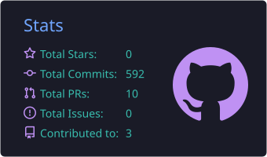
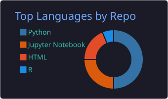
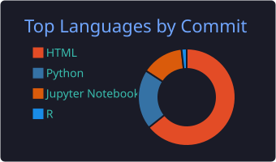
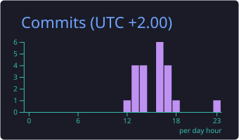
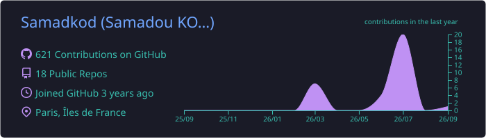

# 

# Bonjour! Bienvenue sur mon profil GitHub 👋

## 👨‍💻 À propos de moi

Data Analyst basé à **Strasbourg** (mobile partout en France), je transforme des données brutes en décisions concrètes.
Mon terrain de jeu : l'assurance, les RH, le retail, les télécoms et les médias — avec un goût
particulier pour les **data apps interactives** qui mettent l'analyse entre les mains des équipes métier.

- 💼 En ce moment : **Chargé de migration de données chez OCEA**
- 📊 Ce que je fais le mieux : KPIs, qualité de données, modélisation prédictive, dashboards
- 🌐 Mon portfolio : [samadkod.github.io](https://samadkod.github.io)

## 📬 Contactez-moi

  
  
  

## 🚀 Projets phares

| Projet | Description | Stack |
|---|---|---|
| 🛡️ [**Assurance Vie DataApp**](https://github.com/Samadkod/assurance-vie-dataapp) · [Démo live](https://assurance-vie-dataapp-6mfedjpgebfw4o5gmbiokf.streamlit.app) | Pilotage d'un portefeuille d'assurance-vie : KPIs interactifs, contrôles qualité, détection des clients à risque, export CSV | `Python` `Streamlit` `Plotly` |
| 📉 [**Churn Prediction**](https://github.com/Samadkod/Churn_prediction) | Prédiction du churn télécoms par machine learning — ~80 % de détection, AUC 0.83, facteurs clés identifiés pour le marketing ciblé | `Python` `scikit-learn` `pandas` |
| 💎 [**Social Listening Luxe**](https://github.com/Samadkod/social-listening-luxe) · [Démo live](https://social-listening-luxe-bjhqf4fartf8c3wqswcv7x.streamlit.app/) | Analyse des conversations Instagram/TikTok autour de Dior, Chanel & Louis Vuitton : tendances, sentiment, recommandations marketing | `Python` `Streamlit` `Plotly` |
| 👥 [**Pilotage RH**](https://github.com/Samadkod/pilotage-rh-streamlit) · [Démo live](https://pilotage-rh-app-fqob5xhyhj3b5wfwduz5vr.streamlit.app) | Dashboard RH temps réel : effectifs, masse salariale, turnover, absentéisme, alertes automatiques par service, export Excel | `Python` `Streamlit` `Plotly` |

## 🔧 Compétences techniques

**Langages & Statistiques**

  
  
  
  

**Machine Learning & Modélisation**

  
  
  

**Data Viz & BI**

  
  
  
  

**Plateformes & Outils**

  
  

## 📊 Statistiques GitHub

  
  

  
  

  

---

  

  Merci de votre visite — n'hésitez pas à explorer mes repos et à me contacter ! 👋

